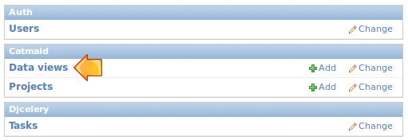
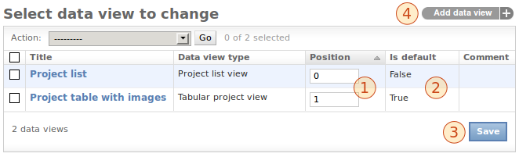
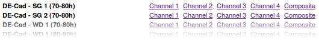

.. _data-views:

Using Data Views
================

Introduction
------------

Providing a good entry point to the different data sets served by a
CATMAID instance is important. Depending on number and type of the
projects and stacks, different views on this data might help you with
keeping an overview or to spot the data set you are interested in.
CATMAID's data views try to help you with that. With them you can
define and tweak the front page of CATMAID.

In fact, you can have as many front pages as you want. The ones
available are accessible through a menu, activated by hovering the
*Home* link in the menu. The one used when the CATMAID site is opened,
differs only in one aspect from the others: it is marked as default.
All data views are configured instances of a particular *data view type*.
They define the basic structure of the page, but allow to pass parameters
to adjust some parts.

Currently, CATMAID comes with two pre-defined data views:
*Project list* and *Project table with images*. The latter is used
as the default, i.e. it is shown when CATMAID is loaded. Both views
have different view types. They are *Project list* and *Project table*.
There is also a third type, that is not used by one of the pre-defined
views: *Legacy project list*. It allows the display of a project list
used before the advent of data views. The details are described below.

Different use cases might require different data view types. How to
extend CATMAID and create own data view types is explained in
section :ref:`creating-data-view-types`.

Configuring Data Views
----------------------

To add new or modify the present views, the Django admin interface is
used. By default, you'll find it at *http://<CATMAID-URL>/dj/admin*
or a similar URL. It is not necessarily the case, that every CATMAID
user can administer data views. This depends on the permissions granted and
in case you can't log-in or don't see the relevant parts within the admin
interface, talk to your CATMAID administrator.

In the admin interface you will be presented different configuration
options for CATMAID. Amongst them, the data view management:

Depending on your CATMAID setup, the admin interface might look a bit
different. Opening the data view configuration will get you a list of
all available data views. By default this looks like this:

Next to the name and the type of each view, the position is visible (1).
With the help of this number you can define the order of the views in
the drop down menu and within this admin view list. The positioning can
be changed right there in the list. If you edited the position numbers, click
*Save* (3) to, well, save your changes. Also indicated is whether a view
is default or not (2). If you want to change this setting, please open up
the configuration of one particular data view (see below). Creating a
new data view can be accomplished by the button in the upper right (4).
The same interface is used for adding new views and editing existing
ones. Editing the default view looks like this:

.. image:: _static/dataviews/admin_data_views_change.png

There are quite some configuration options here: One can easily adjust
the title (1), mark a view as the default (4) or define its position (5).
Setting a data view as the default view, will mark all other views as
non-default at the same time.

If the data view type is changed (2), the help text under the configuration
box (3) is updated accordingly. Every data view type has its own set of
options and the help text will tell you about those. In the case of the
figure above, a *Tabular project view* type is used. A detailed description
of the options available can be found below. The format used to define
them is called `JSON <http://en.wikipedia.org/wiki/JSON>`_ and in order to
only use the default options you have to set the configuration to ``{}``.
If you enter text that cannot be parsed as JSON you will get an error when
saving. Saving invalid text is thereby prevented. Typos in option names,
however, will not be identified.

If wanted, a comment can be added as well. This will be displayed to
the right of the data view title in the menu.

Different Data View Types
-------------------------

Like said above, a data view type defines the general structure of a
concrete data view, but gives some configuration options. For instance,
most of the types offer to show sample images. If an option is not
present in a data views configuration, its default value is used.

Options in help texts usually have the following notation:

  ``"<name>":[option1|option2]``

An option name has to be quoted and the value has to be delimited by a colon.
However, also values might need quoting if they are strings other than
``true`` or ``false`` (and no numbers). Alternative values are separated by
a logical *or*/pipe symbol (``|``) and only one of them can be used. Let's have a look at
the *sort* option as an example: All data view types, except the
*Legacy Project List* type, support the option

  ``"sort":[true|false]``.
 
When set to ``true`` (default), all projects are sorted naturally and when set
to false they are displayed like they come from the database. If we don't
want to have the projects sorted, we could use this configuration:

  ``{"sort":false}``

When multiple options are used, each option is separated by a comma from
another one -- within the same pair of curly braces:

  ``{"name1":opt1, "name2:opt2, ...}``

The remainder of this section will briefly discuss the different data view
types available.

Legacy Project List
^^^^^^^^^^^^^^^^^^^

All data views except this one are processed or the server-side. This project
list is done with the help of JavaScript in the browser of a user. Since it was
the only view available for a long time, it is called "legacy". It supports
an interactive live filter, but it cannot be configured in any way. Therefore,
the configuration is very likely to be just ``{}`` (an empty JSON object). It
looks like this:

.. image:: _static/dataviews/admin_data_views_legacy_project_list.png

Project List
^^^^^^^^^^^^

The appearance of *Project List* is very similar to the one of
*Legacy Project List*. Currently, it doesn't support live filtering of projects,
though. When a project has no stacks, it won't be visible with this view type.
It is processed server-side and offers some configuration options:

================== =========================================== ============
Name               Options                                     Default
================== =========================================== ============
``sort``           ``true, false``                             ``true``
``sample_images``  ``true, false``                             ``false``
``sample_stack``   ``stack index, "first", "last"``            ``0``
``sample_slice``   ``slice index, "first", "center", "last"``  ``"center"``
``sample_scaling`` ``scaling percentage, e.g. 50 or 75``       ``100``
================== =========================================== ============

Like said before, with the help of the ``sort`` option, one can control whether
projects should appear in a natural sorting order. The ``sample_images`` option
defines whether there should be a sample image displayed to the left of each
project entry. If an image is displayed, the ``sample_stack`` option defines
from which stack of the current project the image should be taken. The
``stack index`` value of it represents a single integer (e.g. 0). If this index
is out of bounds, no image is displayed. With the option ``sample_slice`` one
defines which slice of the sample stack should be used as sample image. Again,
``slice index`` is an integer number and no image is shown if this is not
within bounds. The option values ``"first"`` and ``"last"`` refer to the first
and last slice of the stack, ``"center'`` refers to the middle slice is the stack.
To make the sample images appear smaller or larger, the ``sample_scaling`` option
can be used. The assigned number is treated as scaling percentage with respect
to the original sample image size.

So if you were to configure a *Project List* data view with a sample image
which should be the middle slice of every last stack in a project, you would
do this:

  ``{"sample_images":true, "sample_stack":"last", "sample_slice":"center"}``

The result could look like the following:

.. image:: _static/dataviews/admin_data_views_project_list.png

Project table
^^^^^^^^^^^^^

While the *Project List* presents all the stacks of a project as links below
each other, the *Project table* will list all stacks in the same row as the
project name. Especially when there are many projects, this helps to get an
overview of all available image data. It allows the display of images
as well, but in a different way than the *Project List* type. Instead of
providing one image per project, this data view type will show one image per
stack -- replacing the stack name. Like the *Project List* type, it won't
show a project, if it has no stacks associated. The following options are
supported:

================== =========================================== ============
Name               Options                                     Default
================== =========================================== ============
``sort``           ``true, false``                             ``true``
``sample_images``  ``true, false``                             ``false``
``sample_slice``   ``slice index, "first", "center", "last"``  ``"center"``
``sample_scaling`` ``scaling percentage, e.g. 50 or 75``       ``100``
================== =========================================== ============

The ``sort`` option defines, whether the projects are ordered naturally in
the resulting table. If images should be displayed, the ``sample_images``
option should be set to ``true``. Since there is one image per stack, an
option like ``sample_stack`` in the *Project list* type, isn't needed.
However, with the help of the ``sample_slice`` option a slice can be
selected. Again, this can be done with an integer index or one of the
string arguments (mind the quotes!). If the numeric index is out of range,
no image will be displayed. Like in the *Project List* view type, the
option values ``"first"``, ``"center"`` and ``"last"`` refer to the first,
middle and last slice of each stack. To scale the sample image, the option
``sample_scaling`` can be used with a scaling percentage value.

If you wanted to display a text-only table, you would actually not need to
define anything, but ``{}`` (because of the defaults) to get something like:

However, to get an image table with the center slice of each stack where
every sample image is scaled by 65%, you would need to define

  ``{"sample_images":true, "sample_slice":"center", "sample_scaling":65}``

and you would get for example this:

.. image:: _static/dataviews/admin_data_views_project_table.png

