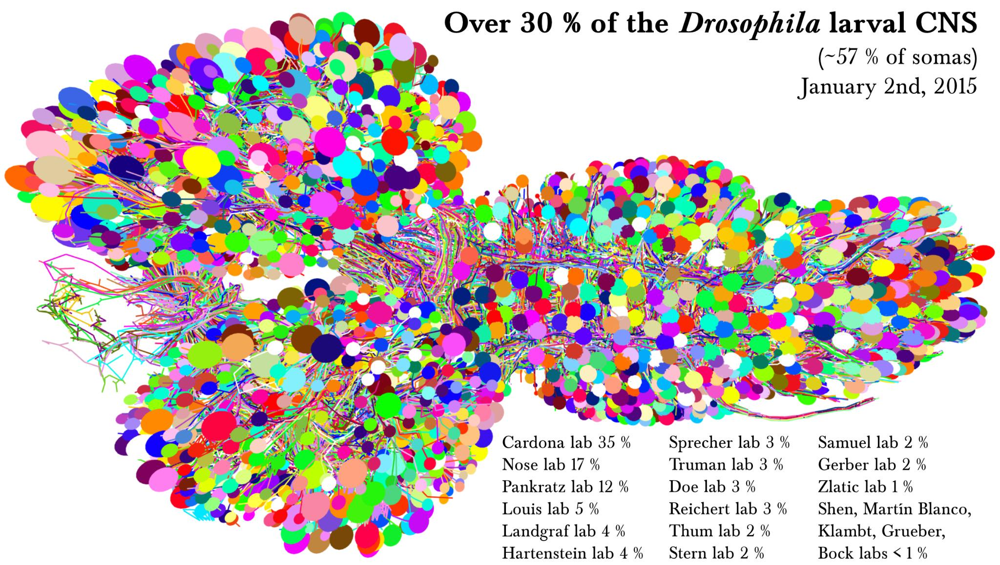
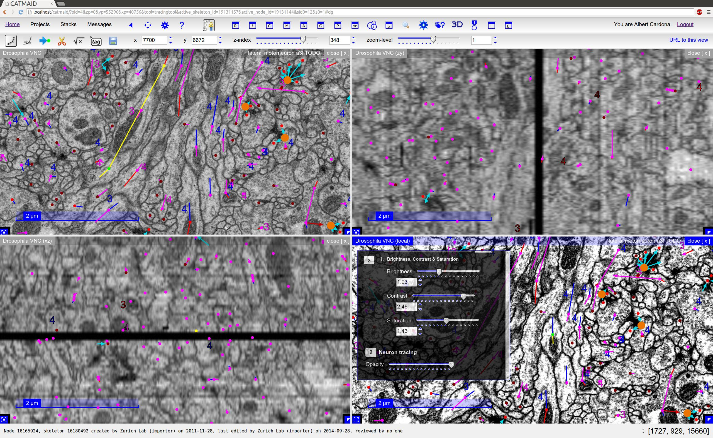
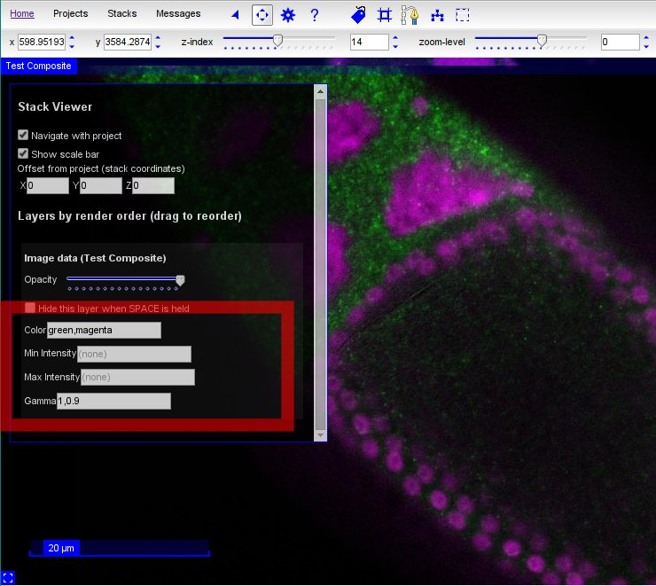

Screenshots and videos
======================

.. raw:: html

        
<iframe width="560" height="315" src="https://www.youtube-nocookie.com/embed/rQyJV0R-Mp8" frameborder="0" allowfullscreen></iframe>
        
Stephan Saalfeld talking about CATMAID, TrakEM2 and ImgLib2

.. raw:: html

        
<iframe width="560" height="315" src="https://www.youtube-nocookie.com/embed/LTErj96y2Vg" frameborder="0" allowfullscreen></iframe>
        
Demonstration of some of the neuron shading options in CATMAID's 3D viewer (v2015.12.12)

.. raw:: html

        
<iframe width="560" height="315" src="https://www.youtube-nocookie.com/embed/KlQNpNvJUc8" frameborder="0" allowfullscreen></iframe>
        
This is the central settings widget of CATMAID (v2015.12.12).

.. raw:: html

        
<iframe width="560" height="315" src="https://www.youtube-nocookie.com/embed/dU5CjzW5tqk" frameborder="0" allowfullscreen></iframe>
        
Clustering widget for ontology based classification graphs (v2015.12.12)

.. raw:: html

        
<iframe width="560" height="315" src="https://www.youtube-nocookie.com/embed/n12pvHd8YT0" frameborder="0" allowfullscreen></iframe>
        
3D view of the 72 hpf
        HT9-4 larva showing fully-traced peptidergic neurons identified by
        siGOLD. This movie was published under a
        <a hef="https://wiki.creativecommons.org/index.php/Frequently_Asked_Questions">CC-BY Licence</a> and was created by
        Shaidi et. al. as part of the publication "A serial multiplex immunogold
        labeling method for identifying peptidergic neurons in connectomes",
        published 15 Dec 2015 in <a href="http://lens.elifesciences.org/11147/index.html">eLife</a>.

.. figure:: _static/screenshots/catmaid-ui.png
   :alt: Basic CATMAID user interface

   The CATMAID User Interface with skeleton annotations and tags

.. figure:: _static/screenshots/catmaid-3d-viewer.png
   :alt: CATMAID 3D Viewer

   CATMAID comes with a 3D viewer

   3D View of *Drosophila* Larval CNS
   *Tracing by Albert Cardona's lab at HHMI Janelia Research Campus and collaborators.*

   Orthogonal views of the same image stack are supported by CATMAID

.. figure:: _static/screenshots/catmaid-tables.png
   :alt: Skeleton node and connector table of CATMAID

   CATMAID's Skeleton Node and Connector Table

.. figure:: _static/screenshots/catmaid-selector-tool-mouse-mirror.png
   :scale: 60 %
   :alt: Selector tool with mirrored cursors in CATMAID

   CATMAID's Selector tool: Mirrored mouse cursor in all open stacks

   Some tile sources in CATMAID support dynamic settings

.. figure:: _static/screenshots/catmaid-nblast-landmarks-pointcloud-kc.png
    :alt: Landmark transformations and NBLAST

    Landmark based transformation of neurons on the right side of the Drosophila larva brain to its left side and NBLAST matching for identification.
