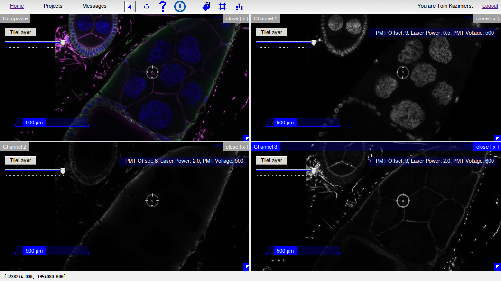

.. raw:: html

        <iframe width="560" height="315" src="http://www.youtube.com/embed/rQyJV0R-Mp8" frameborder="0" allowfullscreen></iframe>

Screenshots
===========

The CATMAID User Interface with skeleton annnotations and tags

.. figure:: _static/screenshots/ui.png

WebGL Neuronal Morphology Viewer

.. figure:: _static/screenshots/webgl.png
   :alt: WebGL Viewer

| WebGL View of *Drosophila* Larval CNS
| *Tracing by Albert Cardona's lab at HHMI Janelia Research Campus and collaborators.*

.. figure:: _static/screenshots/larval_cns.jpg

Orthogonal Views and Image Filters

.. figure:: _static/screenshots/ortho_views.jpg

The Skeleton Node and Connector Table

.. figure:: _static/screenshots/tables.png

Neuron Catalog

.. figure:: _static/screenshots/neuron_catalog.png
   :alt: Neuron Catalog

Selector tool: Mirrored mouse cursor in all open stacks

