.. _spaces:

Spaces
======

If enabled, CATMAID "Spaces" allow you to create and manage your own CATMAID
projects. You can give other users an access token allowing them to participate
in your project. They can either have full read-write access, or just read-only
access. Creating own spaces/projects of course requires a user account.

A typical Spaces workflow with ORCiD based user accounts is shown below. It
provides an overview about the available features.

Example workflow
----------------

The CATMAID “Spaces” feature allows you to create and manage your own CATMAID
projects. On many platforms this is *not* needed if you simply want to browse
the data or use analysis tools. However, if you want to add data, Spaces allow
you to. Plus you can give other users an access token allowing them to
participate in your project. They can either have full read-write access, or
just read-only access.

To get started, you will need an `ORCiD <https://orcid.org/>`_ account. This is
a service to that assigns unique IDs to academic researchers. You don’t have to
be a professor, grad student or undergrad to get an ORCiD, however; you just
need to supply an email address. We like this service because (1) it is
well-established, widely used by journals and funding agencies, free, and
non-commercial; and (2) it helps establish provenance of work done so that
academic credit and history can be more easily tracked across projects and
platforms.

1. Create an ORCiD account
""""""""""""""""""""""""""

As mentioned above, an |orcid| account is needed. If you don't have one already,
head over to `orcid.org <orcid.org>`_ and find the "Register" link in the upper
right corner or click `here <https://orcid.org/register>`_.

2. Open CATMAID Spaces
""""""""""""""""""""""

The `CATMAID Spaces <https://spaces.catmaid.org/>`_ website is publicly
accessible. Without a user account you will be able to browse public datasets
*read-only* (so called *resources*, shown with a magenta bar in the overview).
If you direct your browser to this CATMAID instance, you should be greeted with
a view like this:

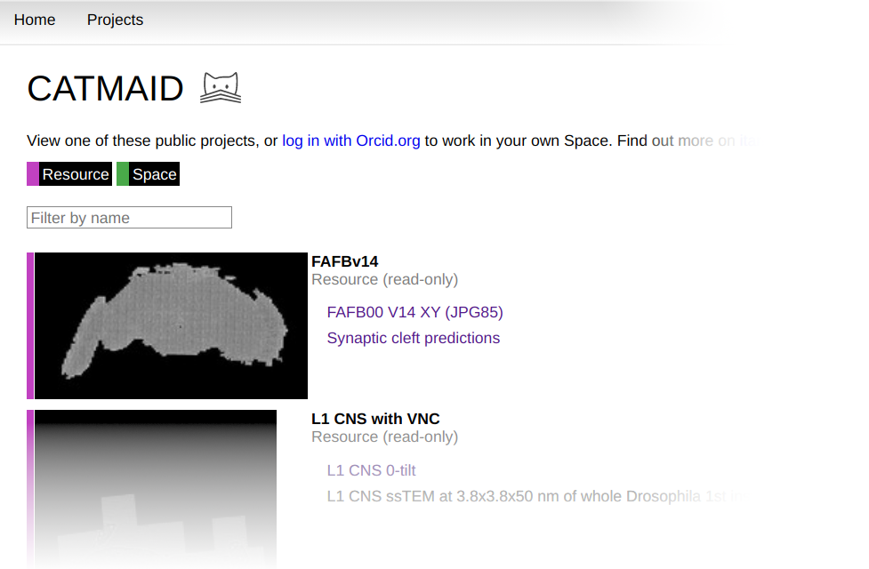

3. Sign-in to CATMAID Spaces
""""""""""""""""""""""""""""

With an ORCiD identifier created, it is now possible to sign-in to `CATMAID
Spaces <https://spaces.itanna.io/catmaid/itanna/>`_, our public CATMAID
instance you just opened. Click on the *Login with orcid.org* link in the upper
right corner of the CATMAID user interface:

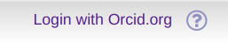

This will make your web-browser to visit the ORCiD log-in page. Once you have
successfully logged in, your browser will send you back to the CATMAID Spaces
CATMAID instance.

4. Open a dataset
"""""""""""""""""

After singing in with your ORCiD account you will start out by seeing the same
datasets like when you are not signed in. Presently, all public datasets are
visible without requiring a log-in. Each dataset is managed in its own read-only
CATMAID project, which are called a resource and indicated through a magenta bar
in the project overview. We will see in the next section how users can create
private (or public) projects and manage access to them (called *spaces*).

The initial project overview provides a filter to quickly find specific
projects. If you find yourself repeatedly visiting the same resources (or
spaces), you can click on the star icon on its preview image to mark it as a
favorite. Favorite projects will appear first in this view.

Apart from the view that shows all visible projects, others are available
as well. They are accessible through the context menu that appears when
hovering the mouse cursor of the Home link in the upper left corner of
CATMAID. For instance, the My Spaces view will show all spaces you are part of
(read-write projects) and the projects you marked favorite. The menu also
allows to mark a particular view as default view that is opened after log-in,
by clicking on the home icon to the right of each entry. Both the menu and the
favorite star are shown below:

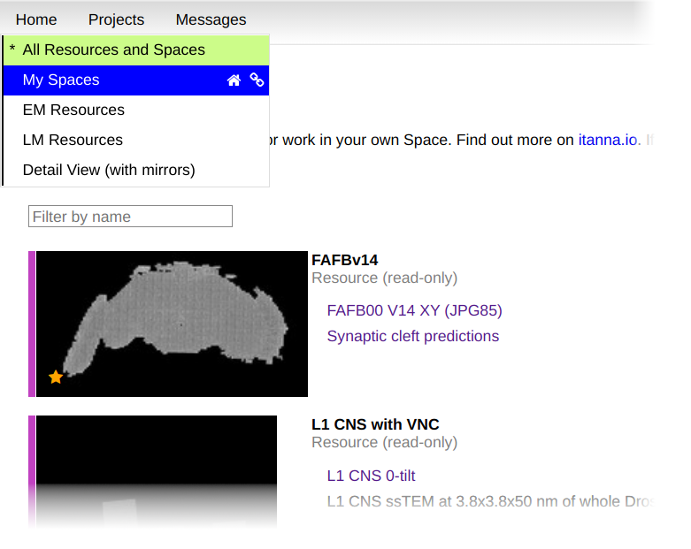

Let's open the first dataset, *FAFBv14*, by clicking either the preview image or
*FAFB00 V14 XY (JPG85)* image stack link shown for the first project. This will
open CATMAID's image browser for this project. In this mode left and center
mouse button will pan the view left and right and the mouse wheel scrolls
through Z. The period sign and comma keys can also be used to change one section
at a time. With plus and minus, the image data can be zoomed in and out.

There are more key shortcuts available that can be shown by pressing *F1* or
clicking on the blue question mark button in the top toolbar (fourth icon
button). Additionally, context aware help is available by clicking the question
mark icon in the upper right corner of CATMAID.

5. The Tracing Tool
"""""""""""""""""""

Besides image data, CATMAID can also work with skeleton data and many projects
do have published neurons available. To open the *Tracing Tool*, click
the neuron-like icon in the top toolbar. This will provide access to more tools,
but they aren’t the focus here. Instead, still with he FAFBv14 dataset open,
scroll to Z = 2740 with the *Tracing Tool* enabled. If you are zoomed out
you should see various magenta dots appear:

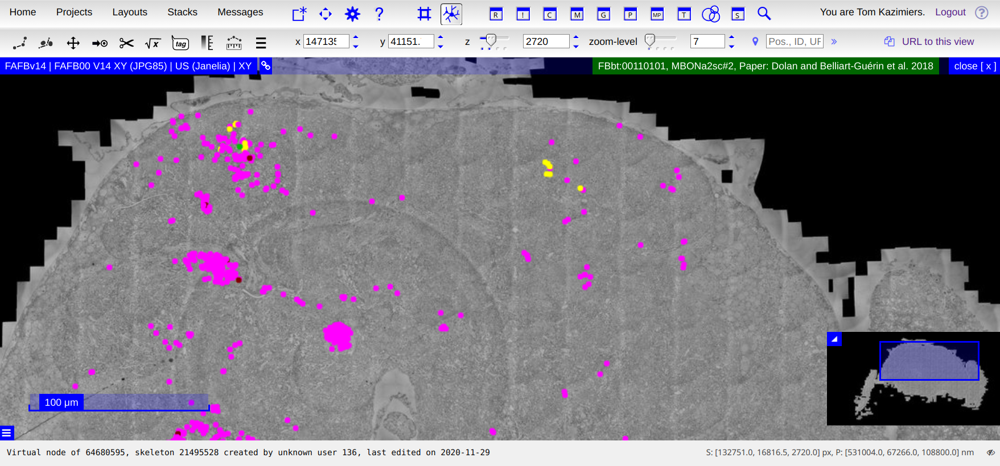

These are skeleton nodes and form line segments to represent neurons and
sometimes other structures. In this screenshot, I selected a node by clicking
on it. The selected node appears in light green and all other nodes that are
part of the same skeleton are shown in yellow. The name of the active skeleton
is show with a green background in the upper right corner of the image data
viewer (“stack viewer”).

Creating new nodes or modifying existing data is in this read-only resource
not allowed. In order to do that, we need to create a new space (read-write
project).

6. Create your own space
""""""""""""""""""""""""

A space is a project where you have full read-write access. In fact, you
create a space, you even have admin access that allows you to configure who
has access to your space.

To create a new space, you need to have a project open to act as a
template, usually this is a read-only resource like the FAFBv14 resource that
we still have opened. The option to create a new space can be accessed from
the user actions menu that appears when hovering the mouse cursor over your
name in the upper right corner:

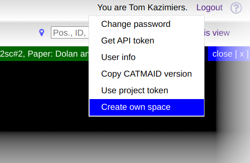

Clicking it will open a new dialog that allows to configure the details of your
new space (which can also be changed at a later time after the space is
created):

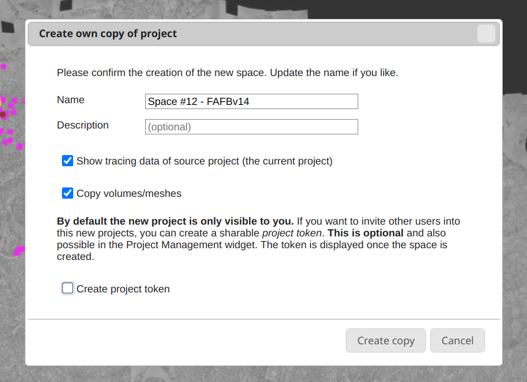

As you can see, CATMAID will offer a default name for the new space, but it
is recommended to pick a clear name in order to make finding it again easier. By
default, the new space will also be configured in such a way that the tracing
data from the origin project (here: FAFBv14) will be shown as a remote data
layer. Also, all existing meshes will be copied into the new project, if the
respective checkbox isn't unchecked.

It is possible to manage already basic access permissions through this dialog as
well. If you intend to give other users access to your new project, click on the
*Create project token* checkbox:

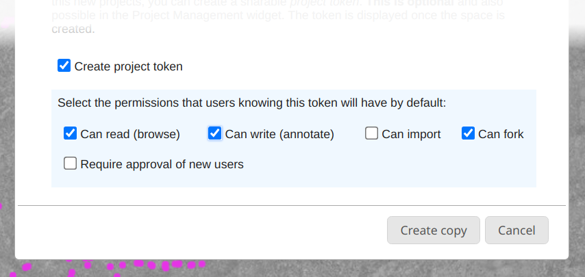

This will show a set of default permissions that can be attached to a new
*project token*, which is created after the new space is created. A project
token acts an *invitation code* to your space. If you send the created project
token to another user, they can use it to gain access to your project with the
specified permissions. The next section will have more details on access
permissions.

Clicking on *Create copy* will create your new space and offers you to switch
right to it once it is ready:

.. image:: _static/spaces/catmaid-space-created-dialog.png
   :scale: 40%

Clicking on *Switch to new space* will open your new project right away and
close the current one. You will have full write permissions. The Project Token
can be copied and sent to other users. We will see in the following section how
project tokens can be used.

7. Your new space
"""""""""""""""""

With your new space available, you can access it either from the front-page
overview, the *My Spaces* view or the *Projects* menu in the top toolbar. After
reloading the CATMAID website, your project will of course continue to exist,
along with all the changes done in it. On the front-page project views, you will
notice that the new space is now marked with a green bar, indicating
*read-write* access:

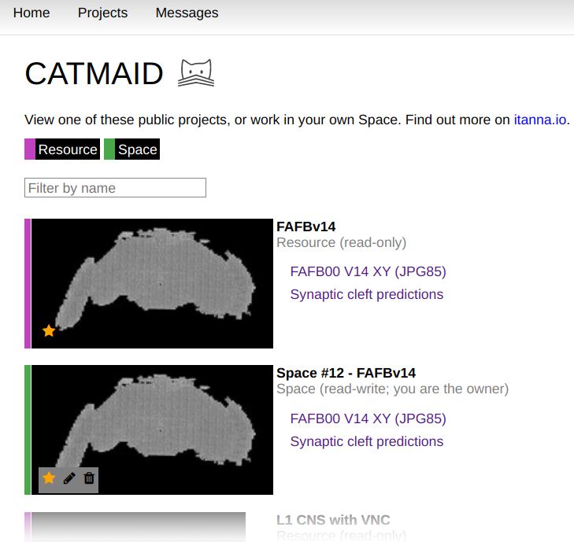

You will notice that on space you have administrative permissions, you also get
access to management tools when hovering your mouse cursor over the thumbnail.
The *pen icon* allows you to change the project name and description and the
*trash can icon* allows you delete your space along with all your data.

Clicking your project thumbnail is exactly the same as clicking on the *Switch
to new space* button in the confirmation dialog after the space was created. To
continue with this tutorial, make sure your newly created space is open.

As project admin you can change project properties and permissions also from
within the open project. This is done through the *Project Management widget*.

Widgets in CATMAID are simple window based tools that can be opened and closed
on demand. While some of them are accessible through the top toolbar when w.g.
the *Tracing Tool* is active (see below), a more general way to open new widgets
is by using the *Open Widget dialog*. It can be opened through the first icon
button in the top toolbar (square and asterisk, 1. in screenshot below) or by
pressing *Ctrl + Space*:

.. image:: _static/spaces/catmaid-project-managment-widget.png
   :scale: 40%

Initially, the *Open widget dialog* (2. screenshot above), will show all
available widgets. In order to find a widget, you can use the filter text field.
The *Enter* key will open the top result, but the up and down keys allow to
cycle through the list and make other results the active one. Double clicking on
a result will open the respective widget, too. In this case we opened the
*Project Management widget* (3. in screenshot above), which gives access to
configuration options like project permissions and other project details. The
next section takes about permissions in more detail.

In the first tab of the *Project Management widget*, all current permission for
this project are shown. Initially, this will only contain your user. As new
users join your project through Project Tokens, they will be listed here as
well. The individual permission checkboxes can be toggled to change the
respective permission. For instance, to give your user the permission for write
access through the API, you can click the respective checkbox. To learn more
about the individual permissions, have a look at the `CATMAID documentation
<https://catmaid.readthedocs.io/en/latest/permissions.html>`_. Most important
are the *can browse (read)* and *can annotate (write)* permissions. Also, make
sure to not remove the *can administer* from yourself, or you lose your admin
permissions (after asking for confirmation).

8. Share your space with others
"""""""""""""""""""""""""""""""

As we have already seen, *resources* are *read-only* projects and *spaces* are
*read-write* projects that were created by a user. By default spaces created by
you are only visible to you. This can be changed by giving individual users or
user groups permissions on your space. These permission can be assigned directly
or they can be attached to so called *Project Tokens*, which then can be applied
by other users, causing them to transfer their stored permissions to the user.

Project Tokens have no limit how often they can be applied. It is however
possible to delete existing project tokens and create new ones. It is possible
to have multiple project tokens defined, with different permissions attached to
them. The *Space Creation Dialog* in step 6 provided one way to create Project
Tokens. Once a space is created, permissions, project tokens and other project
properties can be configured in the *Project Management widget*. The last
section explained how to open it.

To view existing Project Tokens or create new ones, select the *Project tokens*
tab in the *Project Management widget*. If you have created a Project Token
during space creation, this view will look similar to this:

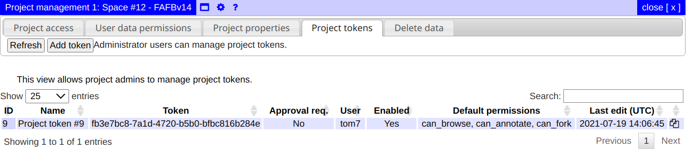

As you can see, this table lists all relevant information on a token and allows
to copy the token, which could then be given to users. New tokens can be created
with the help of the *Add token* button in the widget toolbar close to the tab
controls. This will open a dialog which allows you to configure the new token.

9. Apply a project token
""""""""""""""""""""""""

To use a project token and gain the access defined by it, users need to hover
their mouse cursor over their name in the top right corner and click on *Use
project token*:

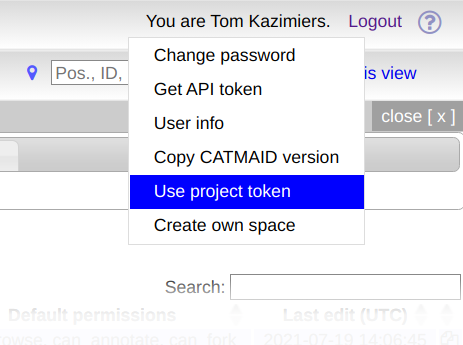

This will open a new dialog that allows users to enter a project token the
received:

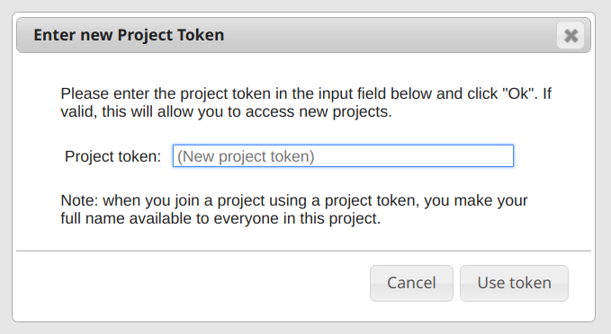

After entering a valid token and clicking *Use token*, users will have the
defined access and see the respective project in the project overviews. Admins
will then see new users also in the *Project permission* table in the first tab
of the *Project Management widget*.

10. General CATMAID usage
"""""""""""""""""""""""""

There are lot of features and tools in CATMAID that we haven’t discussed here.
As mentioned initially, there is a small help button available in the upper
right corner of the CATMAID interface. It shows general context-aware
information on how to work with the user interface. The F1 key and the question
mark button in the top toolbar will open a list of keyboard shortcuts. Depending
on the current tool (navigation, tracing, etc.), different shortcuts are shown.
Some individual widgets come with an integrated help, which is accessible
through the question mark icon in their title bar.

To learn more about how to start tracing neurons or other structures using
skeletons, have a look at the collection of videos in the `CATMAID documentation
<https://catmaid.readthedocs.io/en/latest/tracing-training.html#training-materials>`_.

11. Load data from other/remote projects
""""""""""""""""""""""""""""""""""""""""

Everything that is created in your new CATMAID space is by default only visible
to you. It is however possible to mark projects as readable (and writable) to
others. Projects that have been made visible can then be used as additional
datasources in extra layers in stack-viewer windows (the 2D image and tracing
views). Alternatively, remote data can also be loaded in their own stack-viewer.
In both the extra layer and the own viewer, the data is read-only. This allows
to load e.g. additional image data or tracing data from other CATMAID projects,
which could also live on an entirely different server.

We will look at two different examples that show how both additional image data
and remote tracing data can be loaded into your CATMAID space. Open the FAFBv14
space you created before by either clicking on the preview image or the first
image stack reference named “FAFB00 V14 XY (JPG85)”. Go to a location in the
center of the brain (to see more data), e.g. z = 4000 and change the zoom level
to e.g. 4 in order to see more details.

a) Extra image data
"""""""""""""""""""

The tutorial space includes additional image layers, which can be loaded on
demand. The ones available in a particular project are listed in most data views
(the different front pages that list visible projects) as well as in the *Stacks*
menu in the top toolbar:

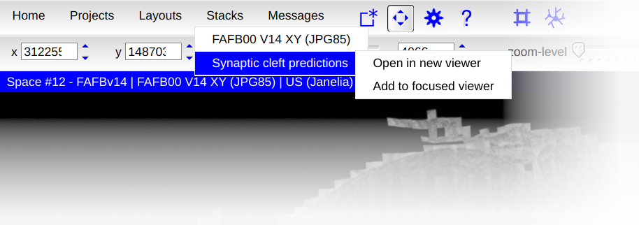

In the case of a FAFBv14 based space, this extra image stack will show synaptic
cleft predictions. The first entry in this menu is the already loaded dataset.
It is is of course possible to load the same stack multiple times, but in this
example the goal is to add an additional image layer that shows different
information. Click on the "Add to focused viewer" entry in the submenu of the
"Synaptic cleft predictions" entry of the Stacks menu. If you are zoomed in a
bit and at a more central Z, your viewer should might display something like
shown at location (1) in the screenshot below: white lines (the synaptic cleft
locations) on a black background.

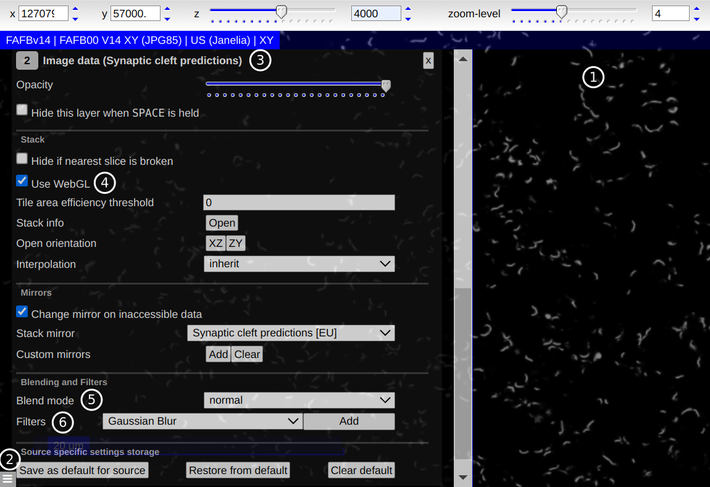

If you instead see the image data just like before and colored synaptic clefts
(like in the next image), no further adjustment is needed. If however, you see
image data and no synaptic cleft data at all, try zooming in some more.

If you see only a black view, open the layer settings by clicking on the options
button in the lower left corner of the stack viewer (location (2) above).
Alternatively, you can press Alt + Space. Find the layer for the newly added
image data (location (3) above). Make sure "Use WebGL" is enabled, both for the
new stack (location (4) above) and the image data layer.

In order to make both the image data and the new layer visible, a different
blend mode has to be selected. From the "Blend mode" drop-down menu, select
"add" (location (5) above). This should make both the image data and the
synaptic cleft data visible at the same time, as shown in the screenshot below:

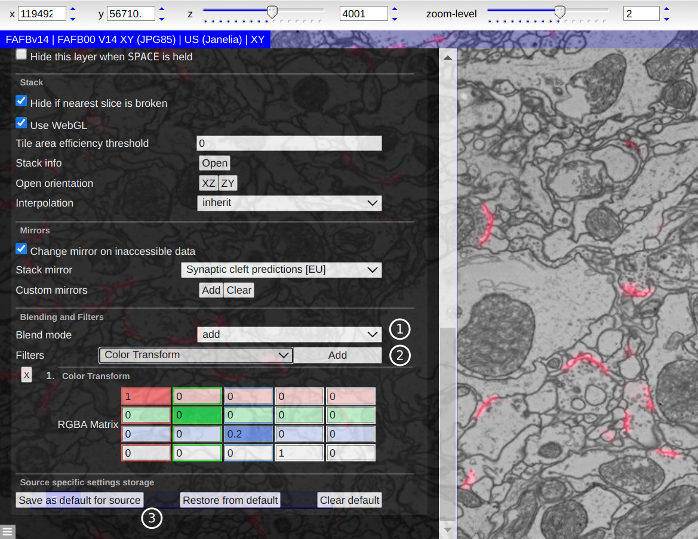

As can be seen, at location (1) the blend mode "add" has been selected and at
location (2) the "Color Transform" filter has been selected. With the filter
selected, press the "Add" button right next to it to use the filter and add
controls for it in terms of a color matrix. This matrix can now be adjusted to
change the color of the synaptic cleft data. The easiest form of adjusting the
color with this matrix is to change the values on the diagonal only.

If you are happy with a setting, you can save it as default for this image stack
by clicking on the "Save as default for source" button, shown at location (3)
above.

a) Tracing data of other projects
"""""""""""""""""""""""""""""""""

Similarly to additional image data, CATMAID allows you to load tracing data from
other sources. Tracing data as well can be added both as a new layer to an
existing viewer or its own new viewer. Other tracing data sources are loaded
through the "More tools" menu, accessible through the last icon button on the
left side of the second toolbar. The "Remote data" entry lists all known local
and remote CATMAID datasources and for each one the visible projects:

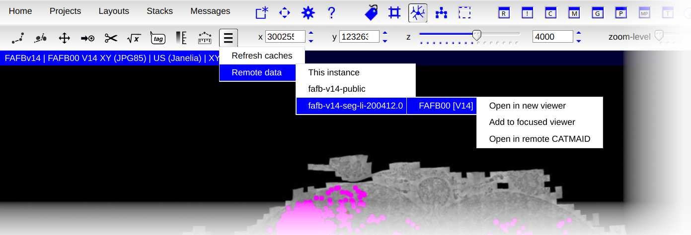

In this example a separate CATMAID instance is selected and from it the
latest skeletonization of Peter Li's segmentation of the FAFBv14 image data.
Clicking "Add to focused viewer" will add it as a layer to the existing viewer:

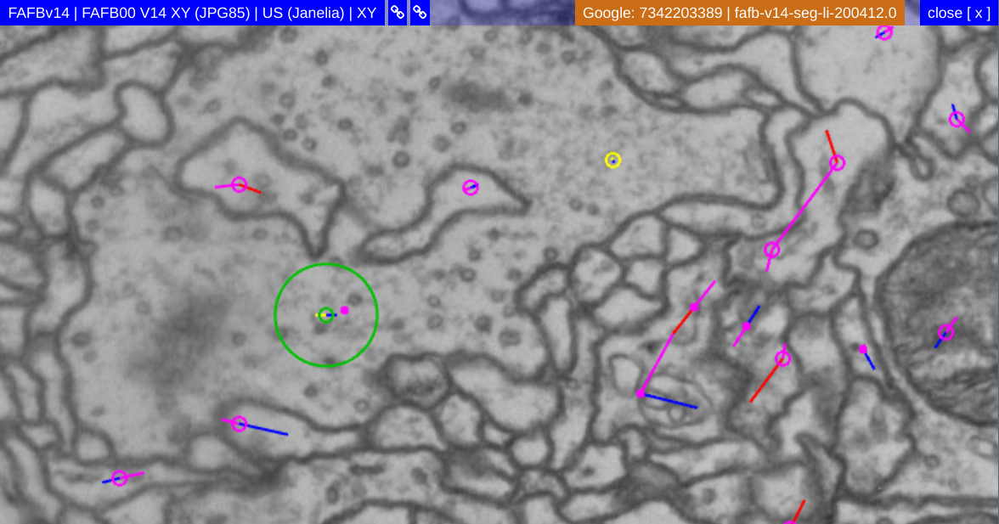

Remote tracing data is not shown with a point by default, but rendered as a
circle. This can be changed in the Settings Widget, if wanted. Also note the
name tag in the upper right corner of the stack viewer. Remote tracing
data is shown with an orange background rather than a green one. For remote
tracing dating, the name tag will also show the source project name.

At the moment, not all CATMAID widgets can work with remote skeletons and
circuits. Many common widgets like the 3D Viewer or the Measurments Table are
able to work with remote skeletons though.

It is possible to import remote skeleton data into the current project/space.
With a remote skeleton selected, the easiest way of doing this is to open the
"More tools" menu from the Tracing Tool toolbar again and click on "Import
active skeleton", like shown in the next screenshot:

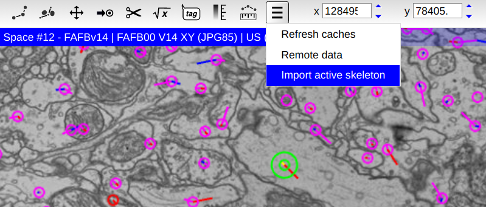

This will open a preview window, showing the full remote skeleton. After
confirming the import, the remote skeleton will be available locally and can be
modified. CATMAID will remember where the skeleton originally came from.
