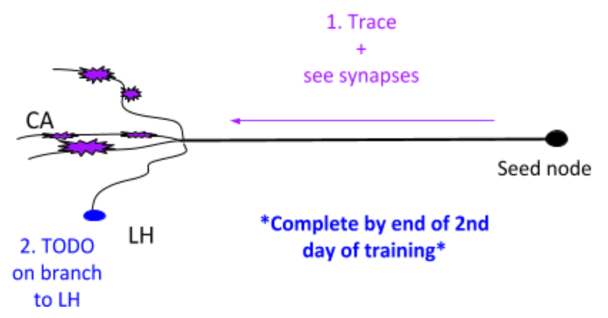
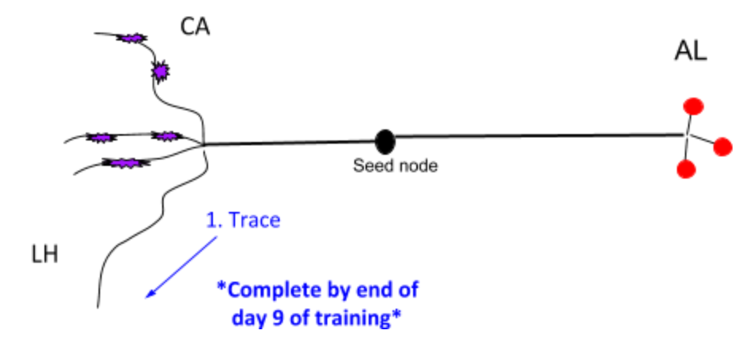
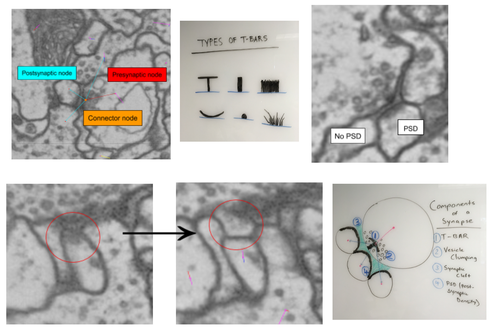

.. _training_tracers:

Training tracers
================

Like with most things, to get good at tracing neurons, some training is needed.
The :ref:`introduction for tracing neurons <tracing-neurons>` helps with first
steps, but managing a whole team and being confident in the quality of the
results, will require some supervision. There are of course many ways on how to
go about this, and an ad-hoc approach is surely fine for smaller groups. Below
we show one example of a systematic approach that was developed by Ruchi Parekh
and trainers in the Connectome Annotation Team (`CAT
<https://www.janelia.org/support-team/connectome-annotation>`_) at Janelia
Research Campus, where it worked for groups of tracers with 20 and more people.

Systematic training and evaluation
----------------------------------

This approach trains new users in using CATMAID and was developed with the `FAFB
<http://temca2data.org/>`_ dataset in mind along with manually reconstructed neurons that have been
published for it. New tracers were asked to reconstruct particular neurons in
increasing difficulty, highlighting different aspects of CATMAID and the
dataset. Selecting such neurons for other dataset requires certainly an expert
tracers.

We found that going through four levels of difficulty over the course of
multiple weeks gave tracers the skills they needed. We started
with asking trainees to look at 22 neurons, eventually settled on 18 though,
where the easiest level now includes only a single neuron. A shared spreadsheet
was used to keep track of the progress of all trainees. This was also used as a
means of communication between trainees and trainers. An example of such a
spreadsheet is shown as table below can be downloaded as `Open Document
Spreadsheet <_static/tracing/training/cat-training-pipeline.ods>`_ or
`Excel format <_static/tracing/training/cat-training-pipeline.xlsx>`_.

.. csv-table:: CAT Training Pipeline
   :class: cat-training-pipeline

    "Neuron name","CAT L1-5 ""initials""","CAT L2-1","CAT L2-2","CAT L2-3","CAT L2-4","CAT L2-5","CAT L3-1","CAT L3-2","CAT L3-3","CAT L3-4","CAT L3-5","CAT L4-1A","CAT L4-1B","CAT L4-2A","CAT L4-2B","CAT L4-3A ***","CAT L4-3B ***","CAT L4-3C ***","*** If soma and soma tract found, then stop tracing"
    "Brain region","Commisure","LO","LH","LP","MB","PB-EB-gall ","Connectives","Noduli ","PB","EB","GNG","--","MB","PB-EB-NO","PB-EB-NO","LP","LP","LP",
    "Cell type","Giant fiber input interneuron","LC4 neuron","Projection neuron ","VSN","KC - CA","PB-EB-gall","CNN","PB-EB-NO","PB-EB-NO","PB-EB-NO","VCN","Giant fiber branch","PN","PB-EB-NO","PB-EB-NO","LPLC","LPLC","HSE",
    "What to trace","Main trunk skeleton only","Trace arborization only (no synapses)","Trace arborization only (no synapses)","Trunk + soma tract + soma (no synapses)","Skeleton + synapses + soma tract + soma","Skeleton + synapses","Skeleton (no synapses)","Skeleton + synapses","Skeleton + soma tract + soma + synapses","Skeleton + synapses (tracing reviewed at 1 week mark)","Skeleton (no synapses) **","Skeleton + synapses","Skeleton + synapses","Skeleton (no synapses)","Skeleton (no synapses)","Skeleton (no synapses) + soma + soma tract","Skeleton (no synapses) + soma + soma tract","Skeleton (no synapses) + soma + soma tract",
    "                                                                Where to trace (Z)","Start on 3470 towards 3469. Stop on 3256.","Start on 4771 towards 4772","Start on 4622 towards 4621","Start on 5368 towards 5369 and stop at end node tagged with ""DO NOT PROCEED"". There will be a small soma tract between the tagged end node and seed node - do not trace beyond the two nodes!","Start on 4991 towards 4992","Start on 1635 towards 1636","Start on 5397 towards 5398","Start on 2869 towards 2868","Start on 4423 towards 4424","Start on 2889 towards 2888","Start on 5588 seed node towards 5055 end node (only stop at 5055 if there is an end node with tag ""DO NOT PROCEED"". Continue if there is no end node)","Start on 3795 towards 3796","Start on 4874 towards 4875","Start on 3569 seed node towards 3570. Stop on ""DO NOT PROCEED"" end node 3698","Start on 2364 seed node towards 2365. Stop on ""DO NOT PROCEED"" end node 2559","Start on 4291 towards 4292. Stop on  ""DO NOT PROCEED"" end node 4925. Find and trace soma tract between start and end nodes","Start on 5638 towards 5637. Stop on 4682. Find and trace soma tract between start and end sections","Start on 6271 towards 6272. Stop on  tagged as ""DO NOT PROCEED"" end node 5830 (only stop on section 5830 if this tag exists). Find and trace soma tract between start and end nodes","Review"
    "Trainee A",,,,,,,,,,,,,,,,,,,
    "Trainee B",,,,,,,,,,,,,,,,,,,
    "Trainee C",,,,,,,,,,,,,,,,,,,

Generally, the training pipeline follows following steps:

1. Trainee - Select "your" neuron name from above CAT LX-X list and search in CATMAID
2. Trainee - Trace neuron
3. Trainee - On completion - update progress sheet
4. Trainee - Pick next neuron from list
5. Trainer - Review completed neuron
6. Trainer - Update progress sheet

Example neuron names in the training dataset are:

- CAT L1-1 SC
- CAT L2-4 LR
- CAT L1-3 AW
- CAT L5-1 TP
- CAT L4-4 CP
- CAT L3-1 SA

The status of each training neuron for each trainee follows the following color
code:

.. csv-table:: Status colors
  :class: cat-training-status

  "Trainee working on tracing", "Trainee completed tracing", "Trainer completed review", "Tracing on hold"

While tracing, trainees where advised to follow the following general guidelines
regarding the use of node tags and edge confidence values:

- use uncertain continuation/uncertain ends as necessary, however you will be
  evaluated based on how you use it
- L2-2 onwards - place confidence intervals as described below for uncertain
  continuations/ends
- L3-5 - If needed, clarify instructions with trainer

With confidence values assigned through the numeric keys 1-5 should be used like
the following:

.. csv-table:: Confidence intervals
  :class: cat-training-confidence

  "",5,4,3,2,1,""
  "I am",100%,75%,50%,25%,0%,"sure it continues/ends"
  "","don't add # 5 to node","add # 4 to node","add # 3 to node","add # 2 to node","add # 1 to node"
  "", "continue tracing","continue tracing if uncertain continuation or stop if uncertain end","stop tracing","stop tracing","stop tracing"

While also using the following rules on deciding when to mark an uncertain
continuation with a tag versus a low confidence value:

.. csv-table:: Tags versus confidence values
  :class: cat-training-tags
  "IF:","THEN:"
  "Uncert. end/cont. + 4 or 5 Confidence Interval","Uncert. end trumps"
  "Uncert. end/cont. + 1 or 2 or 3 Confidence Interval","Add both tags (Uncert. end + Conf. Interv.)"

And in addition:

- **Trainees should ask questions if confused about where to stop**
- **USE uncertain tags when confused about anything**

This document allows trainees to move through a defined and comparable process
to learn about CATMAID and tracing, as well as the dataset itself.

A Trainer would guide new trainees according to the above plan and track their
progress using the different color codes above in the trainee's "swim lane".

Training materials
------------------

CAT Trainer, Henrique Ludwig, has created short tutorials explaining some common
tasks within the FAFB training environment:

.. raw:: html

        
<iframe width="560" height="315" src="https://www.youtube-nocookie.com/embed/FRYLNWroEf4" frameborder="0" allowfullscreen></iframe>
        
Create a seed node

.. raw:: html

        
<iframe width="560" height="315" src="https://www.youtube-nocookie.com/embed/v0a-lV-bh3Q" frameborder="0" allowfullscreen></iframe>
        
Trace and review neurons

.. raw:: html

        
<iframe width="560" height="315" src="https://www.youtube-nocookie.com/embed/cCUasVdhvGA" frameborder="0" allowfullscreen></iframe>
        
Annotate synapses

Introductory Training Protocol
------------------------------

This training protocol is meant to introduce manual neuron reconstruction with
CATMAID, using the FAFB dataset. This dataset consists of the EM data of the
brain of a female adult Drosophila melanogaster. at a resolution of 4 x 4 x 40
nm/vx. An example on how such a brain is dissected and prepared, Janelia's
FlyLight team has some helpful `videos
<https://www.janelia.org/project-team/flylight/protocols>`_. It might also be
worthwile to check out the virtual fly brain `nomenclature
<https://www.sciencedirect.com/science/article/pii/S0896627313011781>`_. A
publicly accessible CATMAID server can be found at `spaces.itanna.org
<https://spaces.itanna.io/catmaid/itanna>`_, which allows creating personal and
shared training projects for the FAFBv14 dataset. `Virtual Fly Brain
<http://catmaid.virtualflybrain.org/`_ also hosts a read-only version of the
FAFB dataset. For those interested in a broader context on the training neurons
and in further understanding of the mushroom body, have a look `here
<http://dx.doi.org/10.7554/eLife.04577.004>`_ and `here
<https://onlinelibrary.wiley.com`_.

When introducing new trainees to CATMAID, the following rough outline seemed
like a useful path to take:

- Open FAFB project from front page
- Browse EM data
- Open Tracing Tool, select a few neurons by both clicking and G key
- Open 3D Viewer and add a neuron, demo space manipulation
- Activate node in 3D to see in EM
- Link from 3D Viewer to EM gray space (F10 function)
- Volume display of neuropils/whole brains (Volumes & Geometry tab in 3D)
- Provide a general intro to hot keys, help page (F1 or ? icon) and context help
  (upper right corner)

Trainers create seed nodes for new trainees, named after their initials (see
video linked above). Assuming this has been done, the following steps are taken
in order to provide an introduction that provides trainees with the skills
required to actually step through the training pipeline.

Protocol
^^^^^^^^

Each trainee will look at three intro neurons, before they can move to the
training pipeline above: **1. PN -> 2. KC -> 3. PN -> 4. Pipeline**.

1. Select `Neuron Search` widget (toolbar icon: tag and question mark)
2. Enter neuron number (users initials) from trainer
3. Click on neuron seed number in window, append in 3D widget using ‘Active
   skeleton’ Start with Projection Neuron (PN)
4. Start at seed node (will be the active node) and place a ‘TODO’ tag
   - go to step 1 ‘Projection Neuron (PN)’ section of protocol
5. Once finished with step 1 PN, trainee will be assigned a Kenyon Cell (KC)
   - Repeat above steps
   - Go to step 2 ‘Kenyon Cell (KC)’ section of protocol
6. Once finished with step 2 KC, trainee will return to finish PN
   - Repeat above steps
   - Go to step 3 ‘Projection neuron (PN)’ section of protocol
7. Once finished with step 3 PN, trainee will move into the pipeline

1. PN - Projection Neuron
^^^^^^^^^^^^^^^^^^^^^^^^^

Besides 1. and 2. in the image above, the goals are also

3. Review own work
4. Review with trainer

**At end of PN - you should know**

**Neuroanatomy**

- Recognize a branching point
- Understand the 3D of branching structures
- Recognize a synapse
  - Understand 4 major indicators
- Recognize differences in morphology of a bouton and fingers of a claw
- Preliminary understanding of ‘stringiness’ (it’s *not* a characteristic of the
  neuron itself- it’s a term we’ve given to describe the morphological ‘look’ of
  the neuron)

**Tracing**

- Place nodes in center
- Create connecting skeletons
- Create “clean” skeleton (i.e. a biologically realistic neuronal skeleton)
- Check your neuron going “forward” and “backward”
- Know how to go from an active node without forming parallel lines
- To tackle small jumps and crappy section

**Software**

- +/- to zoom in and out of EM stack
- Searching for neuron
- 3D viewer - zoom, rotate, activate a node, pre, post and meta tags, taking off
  bounding box and floor, coloring neuron etc
- F10 function
- Tags - L, K, N
- Untag - shift + whatever tag you need to untag (ex: shift+L gets rid of TODO)
- “keyboard shortcut help”

2. KC - Kenyon Cell
^^^^^^^^^^^^^^^^^^^

.. image:: _static/tracing/training/tracing-intro-2.png
  :width: 500
  :alt: KC - Kenyon Cell

Besides 1. to 4. in the image above, the goal is also

5. Review own work
6. Review with Trainer

**At end of KC - you should know**

All “you should know”s from PN + the following:

**Neuroanatomy**

- See further examples of synapses

  - See and recognize structural differences in synapses in KC and PN (especially in the calyx vs lobes)
  - Discuss how some indicators are more prevalent in different brain regions (vesicle clumping in PN boutons vs KC lobes)
  - Discuss different types of syn (e.g. en passant and en face)
- Differences in pedunculus, lobe, and calyx EM anatomy and 3D morphology (refer to Illustration/explanation provided by trainer)

**Tracing**

- Continue to understand how each node helps shape the 3D morphology of the neuron
- Know how to correctly tag soma
- Know how to properly use uncertain tags

3. PN - Projection Neuron
^^^^^^^^^^^^^^^^^^^^^^^^^

Besides 1. in the image above, the goal is also

2. Review own work
3. Review 1-1 with Trainer

**At end of PN - you should know**

All “you should know”s from PN + KC + the following:

**Neuroanatomy**

- Synapses in detail (bouton to claw)
- Invagination
- Cistern/ER
- Vacuole
- Vesicles
- Synaptic cleft
- Mitochondria
- Microtubules - follow for continuations
- Understand the above neurobiology in general context with the understanding
  that each may look different in different brain regions

**Tracing**

- Solid understanding of difference between PN trunk/KC pedunculus (tract) synapse and bouton/calyx (dendritic) synapse

**Software**

- Good sense of the hot keys and how to navigate them without a trainer

Synapse information
^^^^^^^^^^^^^^^^^^^

**Identify** a synapse:

- T-bars - presynaptic protein where vesicles bind and neurotransmitter is released
- Vesicles - small neurotransmitter filled spheres

  - Important to identify clumping around T-bars
  - Scroll between sections to determine how long T-bars and vesicles exist
- Synaptic cleft - extracellular space where neurotransmitter diffuses to postsynaptic partners.

  - The cleft is located between the T-bar and the postsynaptic cells
- Postsynaptic density (PSD) - postsynaptic receptor proteins that signify uptake of neurotransmitter

Note the movement across the first two images of the second row.

Neurons used in training
^^^^^^^^^^^^^^^^^^^^^^^^

- 4PN and 4KC neurons used in training. (Neurons used in training in 2019)
- Uniglomerular mALT VC3l adPN 23135 BH
- Uniglomerular mALT VM5d adPN 49866 JMR
- Uniglomerular mALT VC1 lPN 22133 BH
- Uniglomerular mALT VC3l adPN 46801 JMR
- KCaBs 515202 NM
- KCaBc 514395 NM
- KCaBs 31268 IJA
- KCaBs 7675 EW AJ
