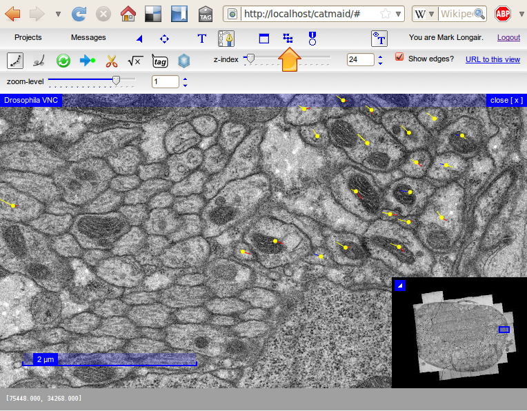
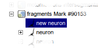

Instructions for Tracing Neurons
================================

Quick Start
-----------

There are step-by-step instructions below, but as a quick-reference, once you're in tracing mode, the following mouse operations and keyboard shortcuts should mostly be what you need:

* **click on a node**: make that node active
* **ctrl-click in space**: deselect the active node
* **ctrl-shift-click on a node**: delete that node
* **shift-click on a treenode**: join two skeletons (if there was an active treenode)
* **shift-click in space**: create a synapse (if there was an active treenode)
* **shift-click in space**: create a post-synaptic treenode (if there was an active synapse)
* **mouse wheel**: move up and down layers in the stack
* **+** and **-**: zoom in and out

(If you're using Mac OS, then in every instance you need to use ⌘ instead of ctrl.)  For help on other keyboard shortcuts, click on the "?" button in the toolbar.

In-depth Instructions
---------------------

Before you can start tracing, you need to log in.  You can do
this in the boxes in the top right hand corner of the page.

Basic Concepts
^^^^^^^^^^^^^^

There are two modes that you'll use in these instructions.  The
"navigate" mode is for moving fast around the stack, and is the
default mode - it's shown in the toolbar with this icon:

.. image:: _static/tracing/tool-icons-navigate.png

To move around in this mode you can:

* Click and drag with the mouse to pan around the dataset, as in
  Google maps
* Use the mouse wheel to scroll through sections
* Press ',' and '.' to move one slice up or down the stack
* Press '<' and '>' to move ten slices up or down the stack
* Press '-' to zoom out
* Press '+' to zoom in
* Click on a section of the overview in the bottom right hand corner
  to jump to that area

In this mode you won't see any of the tracing annotations, however.

First, zoom in on an area that you'd like to start tracing in and
click on the icon to change to tracing mode:

.. image:: _static/tracing/tool-icons-trace.png

If there are any treenodes in view, you'll now see them as yellow dots:

.. image:: _static/tracing/no-edges-with-arrow.png

But you'll probably want to trace with the edges between treenodes
also shown.  You can do that by clicking the "show edges?" checkbox
shown in the image above.  Then the view will look more like:



Before starting tracing, it's a good idea to create a neuron in the
logical structure of the project to keep your tracing organized.
(Otherwise, it will go into the top level "Fragments" folder.)  To
create a neuron (or a group of neurons) you need to use the object
tree, which can be opened with the icon indicated by the arrow in the
image above.

Once the object tree is open, you can navigate down to where you want
to put your neuron.  Then right-click on the group you want to create
a new neuron in, and select "Create neuron":

.. image:: _static/tracing/object-tree-create-neuron.png

You might want to rename the neuron by right clicking on it and
selecting "Rename Neuron".  Now click on your neuron to make sure that
it is highlighted in blue, like this:



While the neuron is highlighted like that, any new skeletons you
create by clicking in the interface will be children of that neuron.
You can now close the object tree (by clicking in the top right hand
corner of the pane).

So, to place the first node in your neuron's skeleton, just left-click
within a membrane that doesn't already have yellow node in it.  You
should see a green node appear, like this:

.. image:: _static/tracing/first-node.png

The green node is always the **active node**.

The Active Node
```````````````
The active node is important, since any new node you create by
clicking will be linked to that node.  To make a different node the
active node, just left-click on it.

(If you want to create a completely new skeleton, there must be
no active node - to deselect it, hold down Control (or ⌘ on Mac
OS) and left-click somewhere other than on a node.)

Try clicking elsewhere within this layer to create a line of nodes.
Try changing the active node to one of the middle nodes, and continue
clicking to create a branch.

You can move any node by clicking on it and dragging it around.

Deleting Nodes
``````````````
To delete a node, hold down Control (or ⌘ on Mac OS) and Shift,
and left-click on the node.

Splitting Skeletons
```````````````````

To split a skeleton into two, select the node at which you want to
split the skeleton, and then click on the "Split Skeleton" icon in the
toolbar, which looks like this:

.. image:: _static/tracing/scissors.png

Then click on the node at which you want to split the skeleton.
You will then end up with two skeletons in the containing
neuron.  All parts of the skeleton from the root node up to and
including the split point will still be in the original
skeleton, but the nodes downstream from that point will be in a
new skeleton.

Joining Skeletons
`````````````````
To join one skeleton to another one, so that they form a single
skeleton, hold down Shift and left-click on a node in the other
skeleton.  (You may not join any part of a skeleton to itself.)

Tagging Nodes
`````````````
To add a tag to the active node, press 't', you should see
something like the following:

.. image:: _static/tracing/tag-after-t.png

Then you can type a tag:

.. image:: _static/tracing/tag-after-writing-todo.png

... and press enter:

.. image:: _static/tracing/tag-after-enter.png

In order to actually save your tag to the database, you then
need to click "Save":

.. image:: _static/tracing/tag-after-save.png

At any time, you can toggle the visibility of the tags with this
button in the toolbar:

.. image:: _static/tracing/tag-toggle.png

Creating Synapses
`````````````````

There are two possible ways of creating synapses.  The
recommended way unless you have many to annotate is the
following:

Suppose you have traced up to the active node in this screenshot
(the green node) and want to annotate the nearby synapse:

.. image:: _static/tracing/synapse-progress0000.png

If you shift-click on the synaptic cleft (or where you think it
should be) you'll see a larger green circle appear, which is a
connector:

.. image:: _static/tracing/synapse-progress0001.png

The purple arrow leading to the large connector indicates that
your original node is presynaptic to the connector.  Then you
can add a postsynaptic partner by shift-clicking in the center
of a membrane that appears to be postsynaptic:

.. image:: _static/tracing/synapse-progress0002.png

By repeating the last step you can mark multiple postsynaptic
partners:

.. image:: _static/tracing/synapse-progress0003.png

When you have finished, click on the origin node again to make
it active and you can carry on tracing.

Dropping Multiple Synapses
``````````````````````````
The alternative approach to creating synapse is to switch to
synapse-dropping mode with this button in the toolbar:

.. image:: _static/tracing/synapse-dropping-button.png

Once you've selected that mode, any click in space on in the
interface will create a synapse, so you can add many in one go,
without needing to start by linking them from a treenode:

.. image:: _static/tracing/synapse-dropping-three.png

In order to carry on tracing, you need to switch back to the
normal tracing mode with this button:

.. image:: _static/tracing/synapse-dropping-switch-back.png

Using the node table
````````````````````

You may need to find a particular node of a treeline, for
example if it was tagged with TODO and you need to go back to
it.  The easiest way to locate particular nodes in a skeleton is
to select a node in that skeleton and click on the treenode
table button:

.. image:: _static/tracing/treenode-table.png

This will bring up a table of all the nodes in that skeleton:

.. image:: _static/tracing/treenode-table-open.png
   :scale: 70 %

You can sort this table by clicking in the column headings.  To
go to a particular node, just double click on the row.

