Instructions for Tracing Neurons
================================

Quick Start
-----------

There are step-by-step instructions below, but as a quick-reference, once you're in tracing mode, the following mouse operations and keyboard shortcuts should mostly be what you need:

* **click on a node**: make that node active
* **ctrl-click in space**: deselect the active node
* **ctrl-shift-click on a node**: delete that node
* **shift-click on a treenode**: join two skeletons (if there was an active treenode)
* **shift-click in space**: create a synapse (if there was an active treenode)
* **shift-click in space**: create a post-synaptic treenode (if there was an active synapse)
* **mouse wheel**: move up and down layers in the stack
* **+** and **-**: zoom in and out

(If you're using Mac OS, then in every instance you need to use ⌘ instead of ctrl.)  For help on other keyboard shortcuts, click on the "?" button in the toolbar.

In-depth Instructions
---------------------

Before you can start tracing, you need to log in.  You can do
this in the boxes in the top right hand corner of the page.

Basic Concepts
^^^^^^^^^^^^^^

There are two modes that you'll use in these instructions.  The
"navigate" mode is for moving fast around the stack, and is the
default mode - it's shown in the toolbar with this icon:

.. image:: _static/tracing/tool-icons-navigate.png

To move around in this mode you can:

* Click and drag with the mouse to pan around the dataset, as in
  Google maps
* Use the mouse wheel to scroll through sections
* Press ',' and '.' to move one slice up or down the stack
* Press '<' and '>' to move ten slices up or down the stack
* Press '-' to zoom out
* Press '+' to zoom in
* Click on a section of the overview in the bottom right hand corner
  to jump to that area

In this mode you won't see any of the tracing annotations, however.

First, zoom in on an area that you'd like to start tracing in and
click on the icon to change to tracing mode:

.. image:: _static/tracing/tool-icons-trace.png

If there are any treenodes in view, you'll now see them as magenta dots:

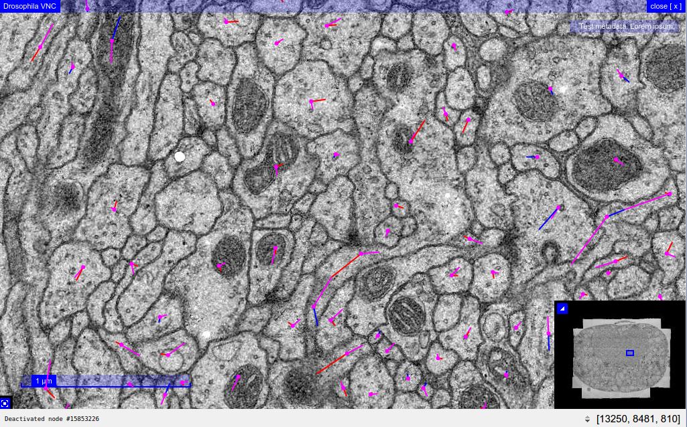

To place the first node in a new neuron's skeleton, just left-click
within a membrane that doesn't already have node in it.  You
should see a green node appear, like this:

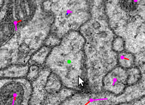

The green node is always the **active node**.

The Active Node
```````````````
The active node is important, since any new node you create by
clicking will be linked to that node.  To make a different node the
active node, just left-click on it.

(If you want to create a completely new skeleton, there must be
no active node - to deselect it, hold down :kbd:`Control` (or :kbd:`⌘` on Mac
OS) and left-click somewhere other than on a node, or press :kbd:`D`.)

Try clicking elsewhere within this layer to create a line of nodes.
Try changing the active node to one of the middle nodes, and continue
clicking to create a branch.

You can move any node by clicking on it and dragging it around.

Deleting Nodes
``````````````
To delete a node, hold down :kbd:`Control` (or :kbd:`⌘` on Mac OS) and
:kbd:`Shift`, and left-click on the node, or activate the node and press
:kbd:`Delete`.

Navigating between Nodes
````````````````````````
While you can navigate through nodes in a skeleton by changing slices and
clicking on nodes, this is cumbersome. Instead, there are many key
shortcuts to navigate through a skeleton based on its topology and
other annotations.

The simplest navigation shortcuts are moving closer to or further from
the root node. Pressing :kbd:`[` will move to the parent of the active node,
closer to the root node. Pressing :kbd:`]` will move to the child of the
active node, further from the root node. If the active node is a branch point,
one of the children will be selected at random.

To discover more ways to navigate nodes, like finding leaf nodes without
children, click the question mark icon in the toolbar to see a list of
keyboard shortcuts.

Splitting Skeletons
```````````````````

To split a skeleton into two, select the node at which you want to
split the skeleton, and then click on the "Split Skeleton" icon in the
toolbar, which looks like this:

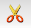

A dialog will appear with a 3D rendering of the skeleton, so you can
visualize what each skeleton will look like once the split is made.
If you are satisfied with the split, press the 'Ok' button.
You will then end up with two skeletons.
All parts of the skeleton from the root node up to and
including the split point will still be in the original
skeleton, but the nodes downstream from that point will be in a
new skeleton and neuron.

Joining Skeletons
`````````````````
To join one skeleton to another so that they form a single
skeleton, activate the node in one skeleton where you would like the join
to occur, then hold down :kbd:`Shift` and left-click on a node in the other
skeleton.  (You may not join any part of a skeleton to itself.)

Tagging Nodes
`````````````
To add a tag to the active node, press :kbd:`T`. You should see
something like the following:

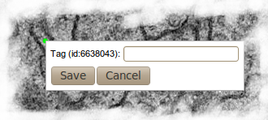

Then you can type a tag:

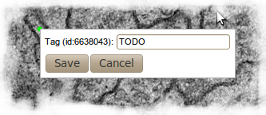

... and press :kbd:`Enter`:

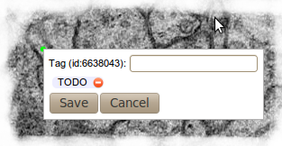

To actually save your tag to the database, press :kbd:`Enter` again:

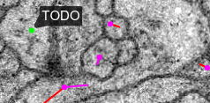

At any time, you can toggle the visibility of the tags with this
button in the toolbar:

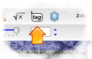

Creating Synapses
`````````````````

There are two possible ways of creating synapses.  The
recommended way unless you have many to annotate is the
following:

Suppose you have traced up to the active node in this screenshot
(the green node) and want to annotate the nearby synapse:

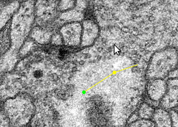

If you shift-click on the synaptic cleft (or where you think it
should be) you'll see a larger green circle appear, which is a
connector:


The red arrow leading to the large connector indicates that
your original node is presynaptic to the connector.  Then you
can add a postsynaptic partner by shift-clicking in the center
of a membrane that appears to be postsynaptic:


By repeating the last step you can mark multiple postsynaptic
partners:

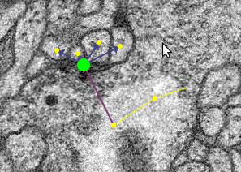

When you have finished, click on the origin node again to make
it active and you can carry on tracing.

Dropping Multiple Synapses
``````````````````````````
The alternative approach to creating synapse is to switch to
synapse-dropping mode with this button in the toolbar:

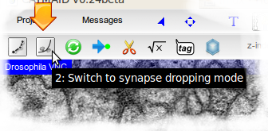

Once you've selected that mode, any click in space on in the
interface will create a synapse, so you can add many in one go,
without needing to start by linking them from a treenode:

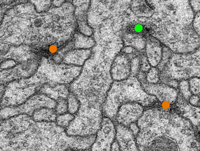

In order to carry on tracing, you need to switch back to the
normal tracing mode with this button:

.. image:: _static/tracing/synapse-dropping-switch-back.png

Using the treenode table
````````````````````````

You may need to find a particular node of a treeline, for
example if it was tagged with TODO and you need to go back to
it.  The easiest way to locate particular nodes in a skeleton is
to select a node in that skeleton and click on the Neuron Navigator
button:

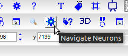

A window will open containing a new Neuron Navigator, which is a *widget*
for exploring neurons and their annotations. CATMAID has many widgets
to help catalog, explore, and analyze your data. In the section of the
Neuron Navigator for the active neuron, click the Treenode Table button:

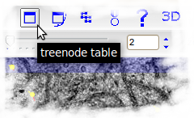

This will bring up a table of all the nodes in that skeleton:

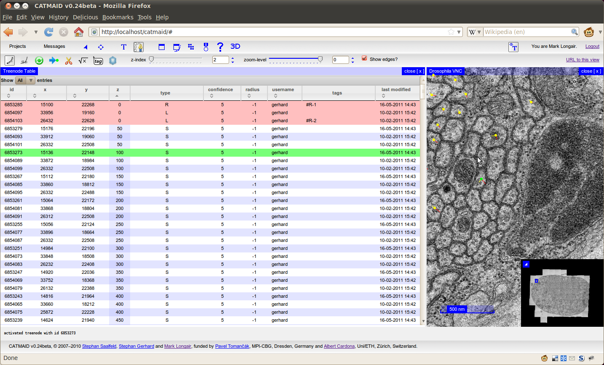

You can sort this table by clicking in the column headings. To
go to a particular node, just double click on the row. To filter by node
type, select an option from the dropdown in the table header. Find the
TODO-tagged node you are looking for by typing "TODO" in the text input
in the tags header and press :kbd:`Enter`:

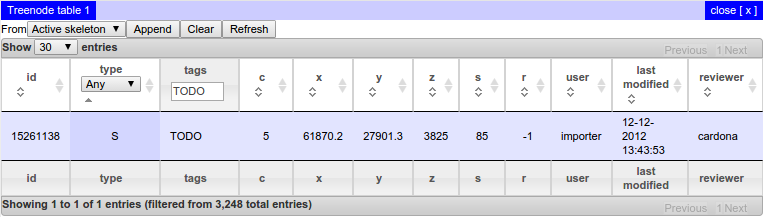

